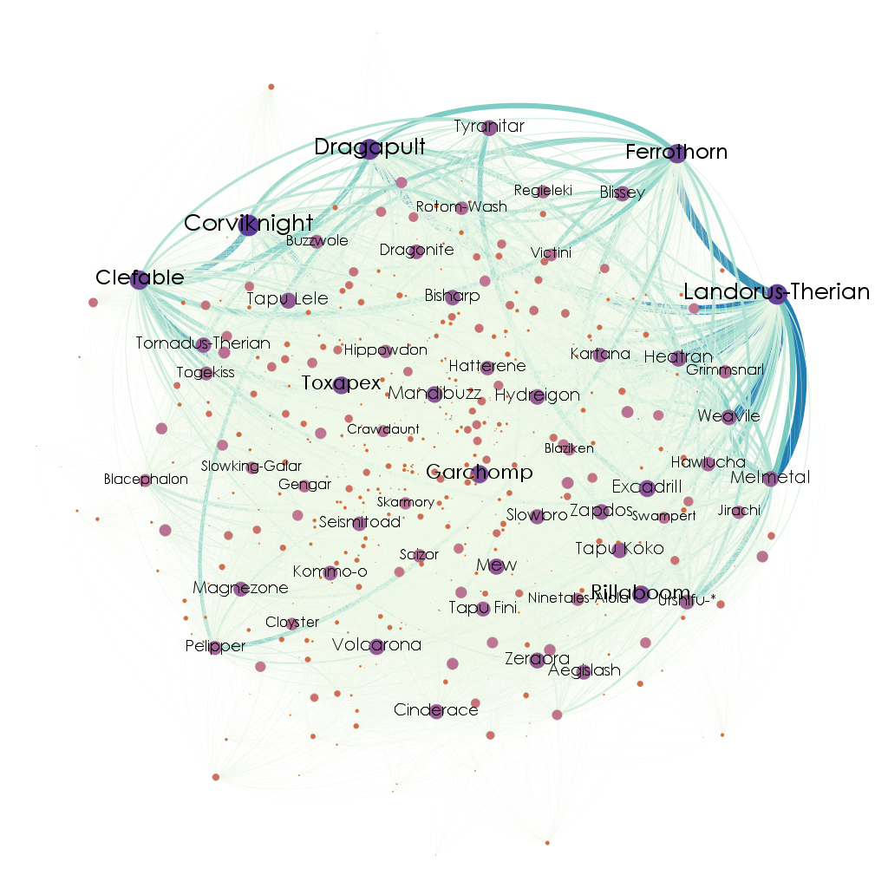

# Técnicas de Mineração de Dados Aplicadas no Contexto de Pokémon


## 📜 Resumo
Este repositório é dedicado à parte de implementação do meu TCC sobre "Técnicas de Mineração de Dados Aplicadas no Contexto de Pokémon" (2022/2), cuja proposta definida por mim trata-se da aplicação de técnicas de mineração de padrões frequentes numa amostra contendo dados de equipes de pokémons utilizadas em batalhas competitivas na _tier_ popular _OU_ (_OverUsed_) no simulador de batalhas online _Pokémon Showdown_ a fim de construir um algoritmo formador de equipes, a visualização dos relacionamentos entre os pokémons da amostra através de grafos e uma análise exploratória de dados sobre os pokémons da 1ª à 8ª geração.

## ✔️ Progresso
- [x] Fazer o pré-processamento dos dados, limpando e transformando a base do formato txt não estruturado para o formato tabular em csv;
- [x] Fazer o _web scraping_ da _ladder_ do _Pokémon Showdown_;
- [x] Aplicar o algoritmo de mineração de padrões frequentes e construir o _team builder_;
- [x] Modelar os dados da amostra como um grafo e exportar a visualização;
- [x] Fazer a análise exploratória dos dados dos pokémons da 1ª à 8ª geração;

## 📁 Estrutura de arquivos:
O projeto é estruturado conforme a descrição abaixo:
```
├── data
│   ├── original    -> bases de dados no formato original e sem tratamento
│   └── processed   -> bases de dados em csv pré-processadas e grafo exportado
└── src
    ├── features    -> contém o script que constrói e exporta o grafo 
    ├── notebooks   -> notebooks com pré-processamento dos dados, web scraping, 
    |                  aplicação do algoritmo de mineração de padrões frequentes e EDA
    └── utils       -> funções úteis
```

